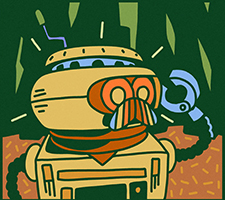

  
  <h3 align="center">BURG.L Discord Bot</h3>
  

    A Discord resource management bot that augments the Grounded gaming experience.
  

---

# About The Project

The BURG.L Discord Bot is a resource manager that aids [Grounded](https://grounded.obsidian.net/) players by tracking requirements and allocating tasks. BURG.L pulls data from the [Grounded Wiki](https://grounded.fandom.com/wiki/Grounded_Wiki) to get information for items, such as crafting costs.

Despite the recent introduction of slash commands by Discord, prefix commands are still used in this project as Discord's in-game overlay does not work with slash commands.

The overall roadmap and development tracker for this project can be found on the Trello board below:  

 

## Planned Features

| Feature | Description |
| ------- | ----------- |
| Object Search | Retrieves object information (e.g. creatures, items, resources, status effects, mutations). |
| Creature Card Search | Retrieves a creature's bestiary card. |
| Chopping List | Tracks player-required resources and their corresponding quantities. |
| Task Scheduler | Keeps track of user-inputted tasks, as well as generating harvesting tasks based on the Chopping List. |
| Database Storage and Caching | Stores permanent data, as well as caching queried data from searches. |

 

## Built With

- [Amazon DynamoDB](https://aws.amazon.com/dynamodb/)
- [Amazon EC2](https://aws.amazon.com/ec2/)
- [Discord.py](https://discordpy.readthedocs.io/)
- [GitHub REST API](https://docs.github.com/en/rest/)
- [Google Custom Search JSON API](https://developers.google.com/custom-search/v1/introduction/)
- [Google Programmable Search Engine](https://programmablesearchengine.google.com/)
- [Python](https://www.python.org/)
- [SteamCMD API](https://www.steamcmd.net/)

 

---

# Usage

## Bot Commands

- `.help`
  - Displays the help menu.
- `.search <object_name>`
  - Displays any available information of the object, including its picture and description. Works with most things, like creatures, resources, equipment, structures, mutations, quests and more.
  - *Use flag `-o` to override any binded shortcuts.*
- `.card <creature_name>`
  - Displays the specified creature's bestiary card.
  - *Use flag `-g` to display the creature's gold bestiary card.*
  - *Use flag `-o` to override any binded shortcuts.*
- `.bind <object_name>, <shortcut_1>, [shortcut_2], ...`
  - Binds an object name to one or more shortcut phrases.
  - *Use flag `-v` to view all binded shortcuts (no arguments required).*
  - *Use flag `-d` to delete shortcuts for specified objects (at least one object_name required).*
  - *Parameters are case-insensitive and must be separated by a comma.*
- `.chop <item_name_1> <quantity_1>, [item_name_2] [quantity_2], ...`
  - Adds one or more specified items to the Chopping List, which tracks player-required resources and quantities.
  - If a specified item is not already a natural resource, it will be broken down into its component materials before being added to the list.
  - *Use flag `-v` to view all items in the Chopping List (no arguments required).*
  - *Use flag `-d` to check one or more specified items off from the Chopping List (quantity is optional; item will be marked as fully completed).*
  - *Use flag `-r` to reset the entire Chopping List (the word 'confirm' is required).*
  - *Parameters are case-insensitive and there is a maximum of 9 parameters per entry.*
  - *Commas are optional unless two item_names are arranged consecutively.*
- `.todo <task_description>, [priority_level]`
  - Adds the given task to the Task Scheduler, which tracks both player-specified tasks as well as auto-generated tasks.
  - *Use flag `-e` to edit a task's priority level (task_ID and new priority level required).*
  - *Use flag `-v` to view all pending tasks in the Task Scheduler (no arguments required).*
  - *Use flag `-d` to check one or more specified tasks off the Task Scheduler (at least one task_ID is required).*
  - *Use flag `-r` to reset the entire Task Scheduler (the word 'confirm' is required).*
  - *Valid task priority levels are:*
    - Low
    - Medium (Default)
    - High
    - Recurring
- `.clear`
  - Clears the webpage data and object information caches.
- `.purge`
  - In a server channel: Purges up to 100 recent messages.
  - In a private message: Purges all of this bot's messages.
- `.sleep`
  - Toggles sleep mode (ignores all other user commands).

 

## Error Codes

| Code | Description |
| ---- | ----------- |
| 101 | Wiki page for the specified object cannot be located. |
| 102 | Wiki page for the specified object has an unsupported layout. |
| 103 | Daily limit of 100 queries for Google Custom Search JSON API has been exceeded. |
| 104 | Bestiary card for the specified creature cannot be located. |
| 105 | Specified object is not compatible with the Chopping List. |
| 106 | Specified item is not present in the Chopping List. |
| 107 | Specified task does not exist in the Task Scheduler. |

 

---

Copyright © 2022, [Sorahawk](https://github.com/Sorahawk)
